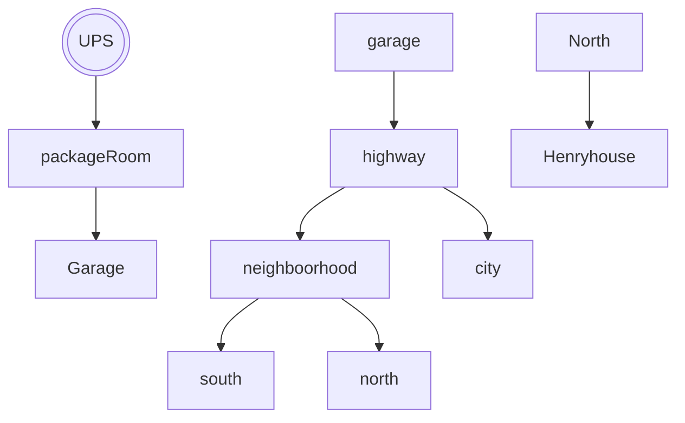

# Henry needs his sweater

## Setting

This game takes place in Arlington. Where you are ups driver with a mission of delivering Henry his
very intresting anime hoodie.

## Map

## Story

You are a UPS and your mission is to deliver Henry his questionable sweater. He must venture out and complete his mission in order to win the game or else he fired.

## Global Variables

packageDelivered = false at the beggining and only until he delivers the package will the var turn into true and the game will end
